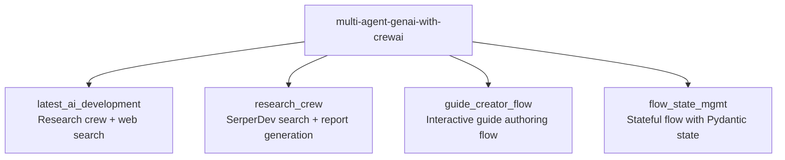

# Multi-Agent GenAI with CrewAI

A collection of **CrewAI** multi-agent experiments demonstrating different patterns of agentic AI: stateful flows, guide generation, live research with web search, and flow-state management. Each subdirectory is a self-contained CrewAI project.

[](https://python.org)
[](https://crewai.com)
[](LICENSE)

---

## Projects



| Project | Pattern | Key Feature |
|---|---|---|
| `latest_ai_development` | Multi-agent crew | Researcher + Writer agents, live web search |
| `research_crew` | Multi-agent crew | SerperDev tool, Markdown report output |
| `guide_creator_flow` | Stateful flow | User-driven topic + audience, structured guide outline |
| `flow_state_mgmt` | Stateful flow | Pydantic state model, chained flow steps, trigger payloads |

---

## Project Details

### `latest_ai_development`
A two-agent crew (Researcher + Writer) that researches a configurable topic using web tools and produces a structured report. Demonstrates role-based agent specialisation and tool use.

```bash
cd latest_ai_development
crewai run
# Default topic: "AI Agents" — edit src/latest_ai_development/main.py to change
```

### `research_crew`
A research crew using **SerperDev** for Google search. Generates a Markdown report saved to `output/report.md`. Demonstrates external tool integration.

```bash
cd research_crew
crewai run
# Default topic: "Artificial Intelligence in Healthcare"
```

### `guide_creator_flow`
An interactive **CrewAI Flow** that prompts the user for a topic and audience level, generates a structured guide outline (via Pydantic models), then populates each section. Demonstrates structured output and human-in-the-loop flows.

```bash
cd guide_creator_flow
crewai flow run
```

### `flow_state_mgmt`
Demonstrates **CrewAI Flow state management** with a Pydantic `PoemState` model. Shows how to pass state between flow steps, respond to trigger payloads, and chain `@start` / `@listen` decorators.

```bash
cd flow_state_mgmt
crewai flow run
```

---

## Setup

Each project is independent with its own dependencies. Use [UV](https://github.com/astral-sh/uv) (recommended by CrewAI):

```bash
# Install UV if not present
pip install uv

# For any subproject:
cd <project_name>
uv sync          # installs from pyproject.toml into .venv
uv run crewai run
```

### API Keys

Create a `.env` file inside each subproject directory:

```bash
# latest_ai_development / guide_creator_flow / flow_state_mgmt
OPENAI_API_KEY=your-openai-api-key

# research_crew — also needs SerperDev
OPENAI_API_KEY=your-openai-api-key
SERPER_API_KEY=your-serper-api-key   # https://serper.dev
```

> `.env` files are gitignored. Never commit API keys.

---

## Key Concepts Demonstrated

| Concept | Where |
|---|---|
| Role-based agent specialisation | `latest_ai_development`, `research_crew` |
| Pydantic structured output | `guide_creator_flow` (GuideOutline, Section models) |
| Stateful flows with `@start` / `@listen` | `flow_state_mgmt`, `guide_creator_flow` |
| External tool use (web search) | `latest_ai_development`, `research_crew` |
| Trigger payload handling | `flow_state_mgmt` |
| Human-in-the-loop input | `guide_creator_flow` |

---

## License

MIT © 2026 Ashish Gupta
