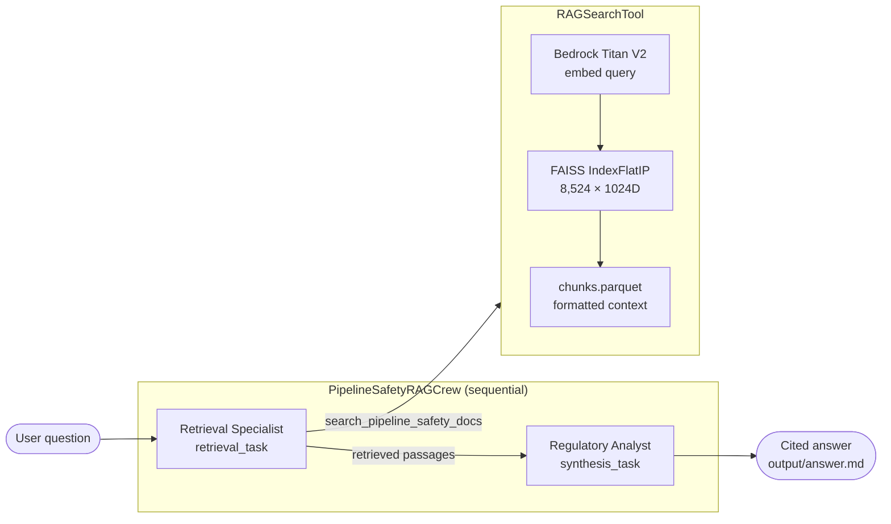

# Pipeline Safety RAG Crew

> Multi-agent CrewAI crew that answers questions about PHMSA pipeline safety
> regulations using a FAISS + Amazon Bedrock Titan V2 retrieval pipeline.

---

## What it does

This crew is a multi-agent port of the RAG pipeline originally built in
[gas-and-energy-mechanics-copilot](https://github.com/ashish-code/gas-and-energy-mechanics-copilot).
It replaces the single Strands agent with two specialised CrewAI agents:

| Agent | Role | Tool |
|-------|------|------|
| **Retrieval Specialist** | Issues targeted searches against the 49 CFR regulation index | `RAGSearchTool` (FAISS + Bedrock Titan V2) |
| **Regulatory Analyst** | Synthesises retrieved passages into a clear, cited answer | — |



---

## Quick start

### 1 — Prerequisites

- Python 3.11+, [uv](https://docs.astral.sh/uv/)
- AWS credentials with Bedrock access (Nova Lite LLM + Titan Embeddings V2, `us-east-1`)
- FAISS index from `gas-and-energy-mechanics-copilot`

### 2 — Install

```bash
cd pipeline_safety_rag_crew
uv sync
```

### 3 — Copy the RAG index

```bash
# From the gas-and-energy-mechanics-copilot repo root:
cp -r data/rag_index/ /path/to/multi-agent-genai-with-crewai/pipeline_safety_rag_crew/data/rag_index/

# Or set RAG_INDEX_DIR to point to it directly:
export RAG_INDEX_DIR=/path/to/gas-and-energy-mechanics-copilot/data/rag_index
```

### 4 — Configure environment

```bash
cp .env.example .env
# Edit .env: set AWS_PROFILE (or explicit AWS keys)
```

### 5 — Run

```bash
# Default question (§192.505 pressure testing)
uv run run_crew

# Custom question
uv run python -m pipeline_safety_rag_crew.main \
  --question "What cathodic protection standards apply to buried steel pipelines under §192.461?"
```

Output is printed to stdout and saved to `output/answer.md`.

---

## Sample questions

```
"What are the pressure testing requirements for steel pipelines under §192.505?"
"Summarise the design factor requirements for Class 1 locations under Part 192."
"What leak survey frequency is required for distribution mains under §192.723?"
"What design standards apply to LNG facilities under 49 CFR Part 193?"
"When is a written operations and maintenance plan required under §195.402?"
```

---

## Configuration

All settings are controlled by environment variables (set in `.env`):

| Variable | Default | Description |
|----------|---------|-------------|
| `MODEL` | `bedrock/amazon.nova-lite-v1:0` | CrewAI LLM for both agents |
| `RAG_INDEX_DIR` | `data/rag_index` | Path to FAISS index directory |
| `BEDROCK_EMBEDDING_MODEL` | `amazon.titan-embed-text-v2:0` | Titan V2 embedding model |
| `BEDROCK_EMBEDDING_REGION` | `us-east-1` | AWS region for Bedrock |
| `RAG_TOP_K` | `5` | Number of chunks retrieved per query |
| `AWS_PROFILE` | `default` | AWS credentials profile |

**LLM alternatives** (set `MODEL=`):

| Model | Provider |
|-------|----------|
| `bedrock/amazon.nova-lite-v1:0` | AWS Bedrock (default) |
| `bedrock/anthropic.claude-3-5-haiku-20241022-v1:0` | AWS Bedrock (faster) |
| `anthropic/claude-3-5-sonnet-20241022` | Anthropic API |
| `openai/gpt-4o-mini` | OpenAI API |

---

## Project layout

```
pipeline_safety_rag_crew/
├── src/pipeline_safety_rag_crew/
│   ├── crew.py                    # PipelineSafetyRAGCrew — agent & task wiring
│   ├── main.py                    # CLI entry point
│   ├── tools/
│   │   └── rag_tool.py            # RAGSearchTool (FAISS + Bedrock Titan V2)
│   └── config/
│       ├── agents.yaml            # Agent role / goal / backstory
│       └── tasks.yaml             # Task description / expected_output
├── data/rag_index/                # FAISS index (not tracked — copy from source repo)
│   ├── index.faiss
│   ├── chunks.parquet
│   └── meta.json
├── output/
│   └── answer.md                  # Latest crew output
├── pyproject.toml
└── .env.example
```

---

## How it differs from the original single-agent solution

| Aspect | gas-and-energy-mechanics-copilot | pipeline_safety_rag_crew |
|--------|----------------------------------|--------------------------|
| Framework | Strands Agent SDK | CrewAI |
| Agents | 1 (search + synthesise) | 2 (retrieval / synthesis separated) |
| Serving | FastAPI + A2A server | CLI / scriptable |
| LLM | Bedrock Nova Lite via Strands | Any CrewAI-supported LLM |
| RAG stack | FAISS + Bedrock Titan V2 | Same (shared `RAGSearchTool`) |
| UI | Streamlit streaming | stdout + output/answer.md |

The separation of retrieval and synthesis into two agents makes it easy to
extend incrementally — add a **query-planning agent**, a **fact-checking agent**,
or a **critique-and-revise loop** in future iterations.

---

## Next steps (iterative improvements)

- [ ] **Query planner agent** — decomposes multi-part questions into sub-queries
- [ ] **Fact checker agent** — verifies the analyst's claims against retrieved text
- [ ] **Memory** — persist conversation history across crew runs (CrewAI Memory)
- [ ] **Hierarchical process** — manager agent routes questions to specialised sub-crews
- [ ] **Streamlit UI** — wrap the crew in a chat interface similar to the original
